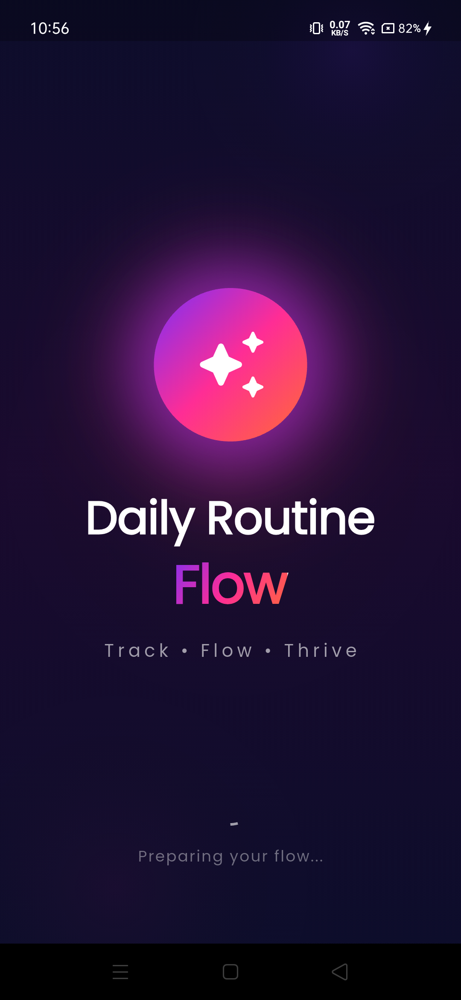
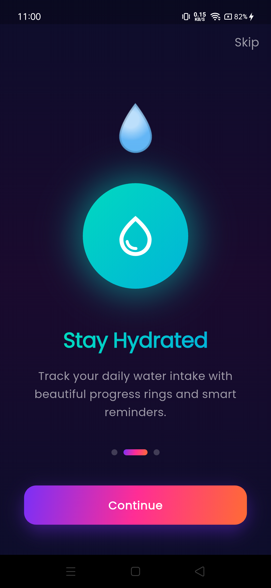
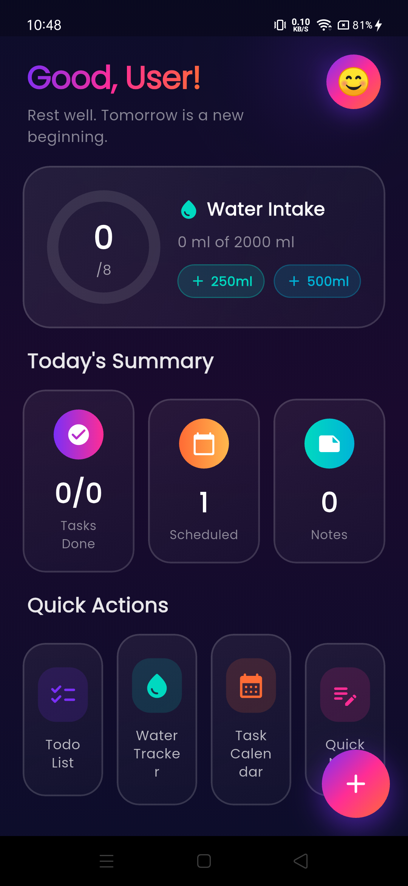
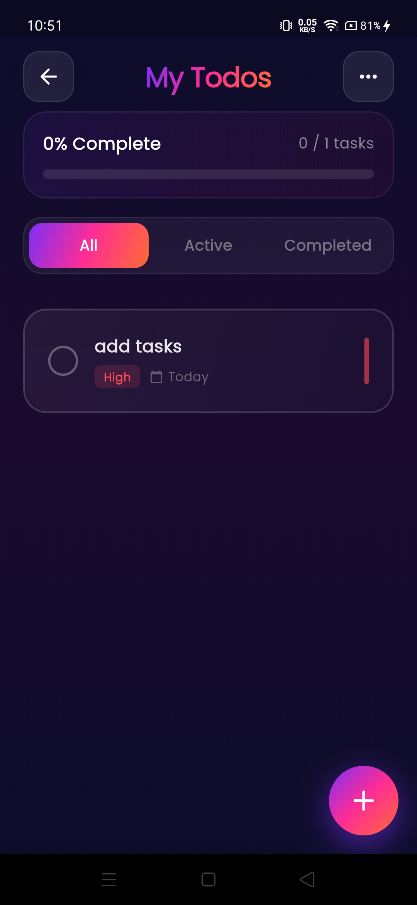
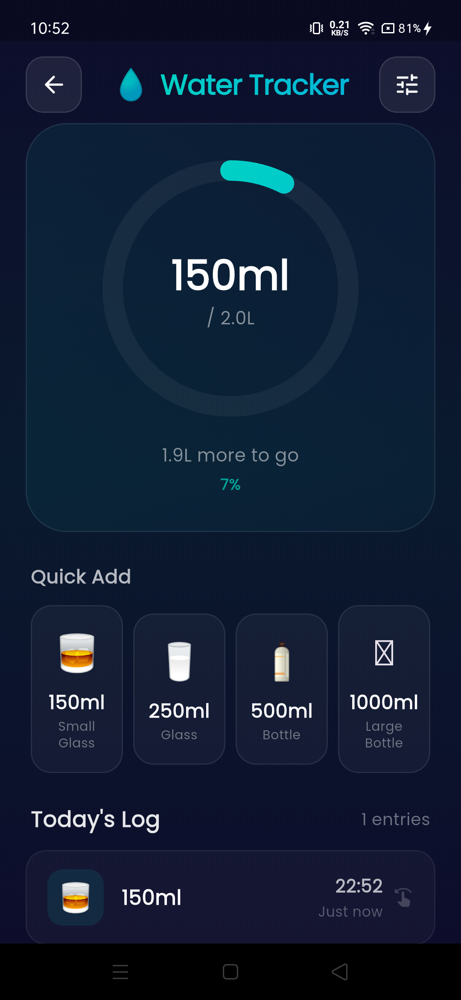
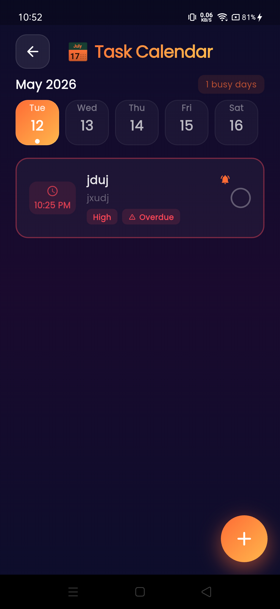
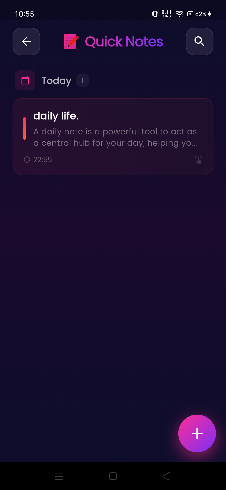
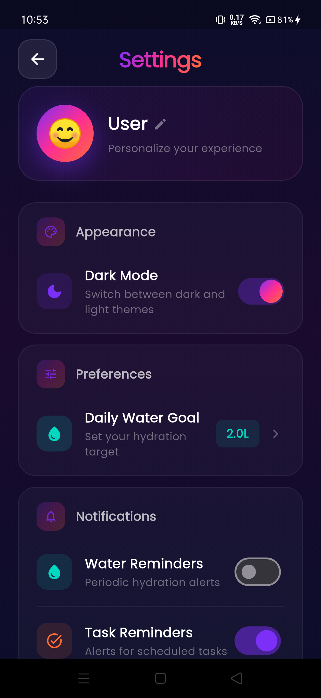

# 🚀 Daily Routine Flow

**Your all-in-one daily productivity companion — Track. Flow. Thrive.**

[Features](#-features) • [Screenshots](#-screenshots) • [Tech Stack](#-tech-stack) • [Architecture](#-architecture) • [Installation](#-installation) • [Contributing](#-contributing)

---

## 📖 Overview

**Daily Routine Flow** is a beautifully designed, feature-rich Flutter mobile app that helps you manage your daily life in one place. Track todos, monitor water intake, schedule tasks by date, and jot down quick notes — all with a stunning glassmorphism UI and smooth animations.

Built with ❤️ using Flutter, Riverpod, SQLite, and Firebase.

---

## ✨ Features

| Feature | Description |
|---------|-------------|
| ✅ **Todo List** | Create, edit, prioritize (Low/Medium/High), and complete tasks with beautiful glass cards |
| 💧 **Water Tracker** | Log daily water intake with animated progress rings, quick-add buttons, and streak tracking |
| 📅 **Task Scheduler** | Schedule tasks by date with a horizontal calendar strip, reminders, and overdue indicators |
| 📝 **Quick Notes** | Write and save color-coded notes organized by date with instant search |
| 🏠 **Smart Dashboard** | Dynamic overview with personalized greeting, water progress, today's summary, and quick actions |
| 🔔 **Smart Notifications** | Local push notifications for task reminders and hydration alerts |
| 👤 **Profile & Settings** | Customizable avatar, name, dark/light theme toggle, water goal, and notification controls |
| 🎨 **Aurora Glass UI** | Custom glassmorphism design system with vibrant gradients, micro-animations, and dark mode |
| 💾 **Local-First** | All data stored locally with SQLite — works offline, no account required |

---

## 📸 Screenshots

| Splash | Onboarding | Dashboard |
|--------|------------|-----------|
|  |  |  |

| Todo List | Water Tracker | Task Scheduler |
|-----------|---------------|----------------|
|  |  |  |

| Quick Notes | Settings |
|-------------|----------|
|  |  |

> *Add your screenshots in a `screenshots/` folder for the best README!*

---

## 🛠 Tech Stack

| Technology | Purpose |
|------------|---------|
| **Flutter 3.7+** | Cross-platform mobile framework |
| **Dart 3.0+** | Programming language |
| **Riverpod 2.5+** | State management (AsyncNotifier, Provider) |
| **SQLite (sqflite)** | Local database for offline storage |
| **GoRouter** | Declarative routing with nested navigation |
| **Firebase Cloud Messaging** | Push notifications |
| **flutter_local_notifications** | Local notification scheduling |
| **Shared Preferences** | Simple key-value storage |
| **Google Fonts** | Typography (Poppins) |

---

## 🏗 Architecture

The project follows **Clean Architecture** with a **feature-first** folder structure:
